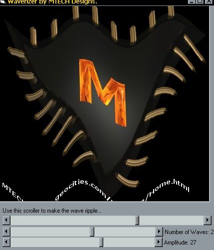



## Real Time Picture Distortion\!

### Description

Yawn I hear you say, Not another Flag waver that distorts a picture in a sine wave pattern....

But wait! How would you like code that does that, which is Fast (under 1 Millisecond!!!), Small (7 Lines!!!) and robust (loads of options), Well you've come to the right place come and check it out. I'm sure you'll be impressed.

P.S. Don't forget to vote :)
 
### More Info
 

             |
---                |---
**Submitted On**   |2000-06-23 23:35:54
**By**             |[Michael Pote](https://github.com/Planet-Source-Code/PSCIndex/blob/master/ByAuthor/michael-pote.md)
**Level**          |Advanced
**User Rating**    |4.6 (23 globes from 5 users)
**Compatibility**  |VB 3\.0, VB 4\.0 \(16\-bit\), VB 4\.0 \(32\-bit\), VB 5\.0, VB 6\.0
**Category**       |[Custom Controls/ Forms/  Menus](https://github.com/Planet-Source-Code/PSCIndex/blob/master/ByCategory/custom-controls-forms-menus__1-4.md)
**World**          |[Visual Basic](https://github.com/Planet-Source-Code/PSCIndex/blob/master/ByWorld/visual-basic.md)
**Archive File**   |[CODE\_UPLOAD70456232000\.zip](https://github.com/Planet-Source-Code/michael-pote-real-time-picture-distortion__1-9173/archive/master.zip)

